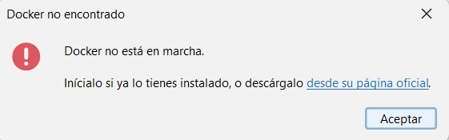
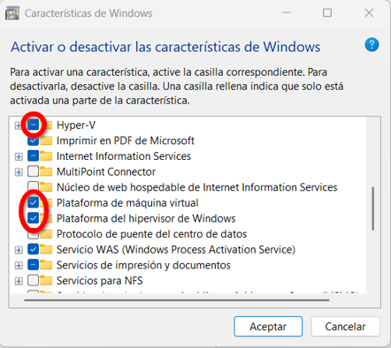
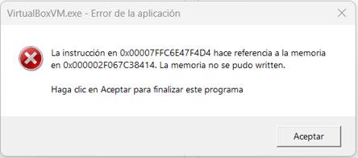

# Problemas en Windows 11

## Síntomas

Al arrancar UOCDBLauncher.exe aparece un mensaje de error:

Más aún, al intentar arrancar Doker Desktop aparece este error:

## Solución

En “Activar o desactivar las características de Windows” (puedes buscarlo literalmente usando tecla de Windows+S) activar “Hyper-V” “Plataforma de máquina virtual” y “Plataforma del hipervisor de Windows”, como se ilustra en la siguiente imagen:

Pulsar en “No reiniciar”, ya que falta una configuración extra, que se describe a continuación.

En “Aislamiento del núcleo” (de nuevo puedes buscarlo literalmente usando tecla de Windows+S) activar la integridad de memoria como se ilustra a continuación:

Ahora sí, cuando nos lo pida, reiniciemos el equipo, asegurándonos primero que hemos guardado todo el trabajo importante y cerrado todas las aplicaciones.

Tras el reinicio, Docker Desktop debería arrancar con normalidad y, tras ello, UOCDBLauncher.exe arrancar correctamente.

## Nota importante

Aplicar este procedimiento hará que Docker Desktop funcione pero podría hacer que otras aplicaciones de virtualización dejaran de funcionar. Por ejemplo, se ha detectado que hay incompatibilidades con VirtualBox, que empieza a mostrar errores como este al intentar arrancar sus máquina virtuales:

En tal caso, puede revertirse el procedimiento haciendo las configuraciones inversas.

