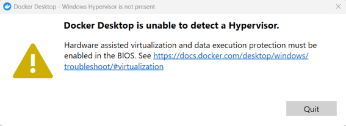
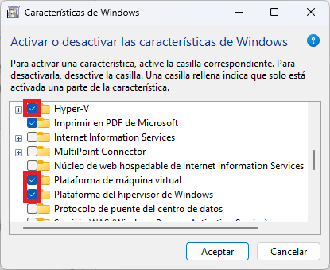

# Instal·lació i execució del llançador de bases de dades

:::steps

1. **Instal·leu Docker.**

   Us recomanem fer-ho mitjançant
   [Docker Desktop](https://docs.docker.com/get-started/get-docker/). Si feu servir qualsevol altre mètode, us exposeu a problemes i ho feu sota la vostra responsabilitat.

2. **Descarregueu el llançador** corresponent al vostre sistema operatiu.

    * Si teniu **Mac**: executeu `uname -m` en un terminal. Si retorna `arm64`, descarregueu `macos-arm64.zip`; si retorna `x86_64`, descarregueu `macos-x64.zip`.

3. **Descomprimiu** el llançador en un directori de la vostra elecció.

4.  **Ajusteu els permisos d’execució del llançador.**

    Només ho heu de fer la primera vegada.

    - Si teniu **Windows**: botó dret sobre `UOCDBLauncher.exe` $\to$ Propietats $\to$ General $\to$ Desbloqueja $\to$ Aplica.
    - Si teniu **Mac**: executeu al terminal:

        ```shell
        sudo xattr -dr com.apple.quarantine UOCDBLauncher.app
        ```
    - Si teniu **Linux**: executeu al terminal:
        ```shell
        sudo chmod +x bin/UOCDBLauncher
        ```

5. **Assegureu-vos que Docker Desktop s’estigui executant.**

   Si no ho està, obriu-lo i espereu que acabi d’arrencar.

6. **Executeu el llançador** fent doble clic sobre el binari `UOCDBLauncher`.

7. Seleccioneu el vostre **idioma** al menú superior.

8. Feu clic a **Tutorial** al menú superior i seguiu les instruccions per aprendre a fer servir el llançador.

:::

> [!IMPORTANT]
> Si teniu qualsevol problema durant la instal·lació, heu de posar-vos immediatament en contacte amb el professor de l’assignatura per correu electrònic (Francisco Martínez Lasaca, fmartinezlasa@uoc.edu).

## _Troubleshooting_ a Windows 11

### Docker Desktop no arrenca: falta l’hipervisor

En arrencar `UOCDBLauncher.exe` **indica que Docker no està en marxa** i, en intentar arrencar Docker Desktop, apareix aquest error:



Per solucionar-ho:

:::steps

1. **Activeu les característiques de Windows.**

   A «**Activar o desactivar las características de Windows**» —podeu cercar-ho literalment prement Windows + S— activeu «**Hyper-V**», «**Plataforma de máquina virtual**» i «**Plataforma del hipervisor de Windows**», tal com s’il·lustra a la imatge següent:

   

2. Premeu «**No reiniciar**».

3. **Activeu la integritat de memòria.**

   A «**Aislamiento del núcleo**» —de nou podeu cercar-ho amb Windows + S— activeu-la tal com s’il·lustra a continuació:

   

4. **Reinicieu l’equip** quan el sistema ho demani.

    Assegureu-vos abans de desar tota la feina important i tancar totes les aplicacions.

5. **Comproveu que arrenca.**

   Després del reinici, Docker Desktop hauria d’arrencar amb normalitat i, tot seguit, `UOCDBLauncher.exe` correctament.

:::

> [!WARNING] Docker i VirtualBox poden no conviure
> Aplicar aquest procediment fa que Docker funcioni, però **és possible que altres aplicacions de virtualització deixin de fer-ho**: el processador presta les extensions de virtualització a un sol programa alhora, i Hyper-V les reclama en arrencar Windows. Amb VirtualBox, per exemple, màquines virtuals creades prèviament a l’activació de Hyper-V (és a dir, amb Hyper-V desactivat) poden mostrar el següent error en arrencar:
>
> 
>
> Si el preferiu al llançador, desfeu els canvis; si necessiteu tots dos, VirtualBox 6 i posteriors funcionen **sobre** Hyper-V, encara que de manera menys eficient (i amb màquines virtuals que no hagin estat creades amb Hyper-V desactivat).

:::pagebreak

### El llançador no detecta Docker encara que estigui en marxa

Executeu des d’un terminal l’ordre `docker info`.

- **Si al terminal també falla**, el problema és de Docker i no del llançador: arrenqueu-lo i, si tot i així no respon, reviseu l’apartat anterior.
- **Si al terminal respon i el llançador continua sense veure’l**, falta Docker al PATH de la vostra sessió, perquè la vau obrir abans d’instal·lar-lo. Tanqueu la sessió de Windows i torneu a entrar —o reinicieu l’equip— i obriu el llançador un altre cop.

