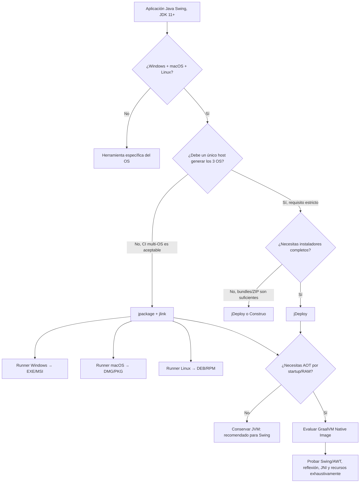
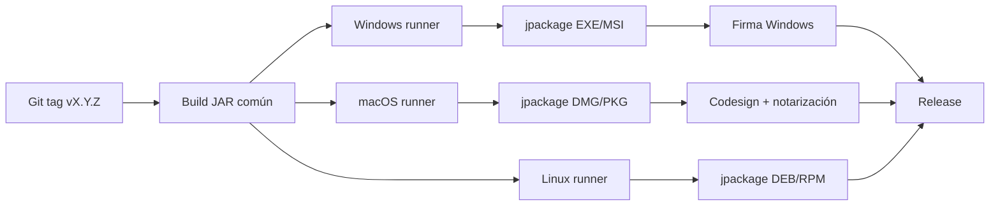

# Empaquetado multi-OS de una aplicación Java Swing moderna: JavaPackager, Packr, JSmooth y alternativas actuales

## Resumen ejecutivo

Para una aplicación **Java Swing de escritorio, con ventanas, destinada a Windows, macOS y Linux**, hay que separar dos requisitos que a menudo se mezclan:

1. **Multi-OS de ejecución:** poder entregar una aplicación nativa para Windows, macOS y Linux.
2. **Multi-OS de compilación/empaquetado:** poder generar los tres artefactos **desde un único sistema operativo**, por ejemplo producir `.exe`, aplicación macOS y paquete Linux desde una máquina Linux.

Esa distinción cambia por completo la recomendación.

Mi conclusión, a fecha de **4 de septiembre de 2026**, es:

| Opción | Swing | Win + macOS + Linux | ¿Los tres desde un solo host? | JDK 11+ | Actividad / vigencia | Veredicto |
|---|---:|---:|---:|---:|---|---|
| **jDeploy** | ✅ | ✅ | **✅ Sí, explícitamente** | ✅ 8/11/17/21/etc. | **Muy actual: manual 6.1, marzo de 2026** | **Mejor ajuste si el cross-build real es obligatorio** |
| **jpackage + jlink** | ✅ excelente | ✅ | ❌ No | ✅ excelente | **Parte del JDK 26 actual** | **Mejor solución estándar/robusta si se acepta CI con 3 OS** |
| **Construo** | ✅ por JVM | ✅ | **✅ orientado a cross-build** | ✅ | Proyecto más pequeño | Muy interesante para ZIP/app bundles, menos completo como instalador |
| **GraalVM Native Image** | ⚠️ posible, pero más complejo | ✅ según plataformas soportadas | ❌ en la práctica requiere toolchain del target | ✅ | **Muy activo; 25.3.4.1 de 25-08-2026** | Solo si AOT/startup/memoria justifican la complejidad |
| **JavaPackager** | ✅ | ✅ | ⚠️ parcial | ✅, con matices | Mantenedor solicita ayuda; release 1.7.6 en 2024 | No lo elegiría para un proyecto nuevo |
| **Packr** | ✅, diseñado para GUI | ✅ | ⚠️ posible para bundles, no garantizado como matriz completa | ✅, aunque envejecido | Último release 4.0.0 en 2021; últimos cambios visibles 2024 | Legacy; no recomendable para proyecto nuevo |
| **JSmooth** | ✅ Windows | **❌ Windows solamente** | ❌ | ⚠️ legado | Proyecto esencialmente legacy | **Descartado** |
| **Launch4j** | ✅ Windows | **❌ Windows solamente** | Puede crear Win desde otros hosts | ✅ con configuración | Proyecto histórico | Complemento Win, no solución multi-OS |
| **Badass jlink/runtime plugins** | ✅ | ✅ mediante jpackage | ❌ por restricción de jpackage | ✅ | Útiles, pero dependientes de jpackage | Buena ergonomía Gradle, no resuelve cross-build |

La recomendación concreta es, por tanto:

**Si “VERY IMPORTANT multi-OS” significa literalmente “quiero ejecutar un único build en Linux/Windows/macOS y que de ahí salgan artefactos para los otros dos sistemas”, elegiría primero `jDeploy`.** Su documentación de marzo de 2026 afirma expresamente que puede construir instaladores nativos para **macOS, Windows y Linux desde cualquier plataforma**, sin depender de herramientas de terceros aparte de OpenJDK; además soporta explícitamente aplicaciones Swing y las arquitecturas x64/ARM64 modernas. citeturn17view1

**Si puedes utilizar CI con runners Windows + macOS + Linux, elegiría `jpackage + jlink` como solución principal de producción.** Es la opción más cercana al estándar de Java, está incluida en el JDK 26 actual, entiende JPMS, genera runtimes autocontenidos, produce `.exe/.msi`, `.dmg/.pkg`, `.deb/.rpm`, y evita depender de un empaquetador comunitario. Su única gran desventaja para tu requisito es deliberada: Oracle/OpenJDK especifica que **cada formato debe construirse en la plataforma donde se ejecutará; no existe cross-platform packaging**. citeturn18view0

Para una aplicación Swing normal **no recomendaría GraalVM Native Image como primera opción**. Native Image es excelente cuando la prioridad es arranque prácticamente inmediato y menor consumo de memoria, pero AWT/Swing, JNI, reflexión, carga dinámica de recursos y bibliotecas nativas hacen que el modelo de análisis cerrado de Native Image sea considerablemente más delicado que ejecutar Swing sobre una JVM convencional. GraalVM documenta precisamente que reflexión, JNI, proxies y recursos que el análisis estático no puede detectar pueden requerir *reachability metadata* o el *tracing agent*. citeturn7search3turn7search0

> **Recomendación final:** para tu caso elegiría **jDeploy** cuando *cross-building desde un único host* sea una condición innegociable; elegiría **jpackage + jlink + una matriz CI de tres sistemas operativos** cuando prime la robustez, el control del runtime, la firma propia, la integración con Java moderno y la sostenibilidad a largo plazo.

## Qué significa realmente «multi-OS» para Swing

Una aplicación Swing necesita `java.desktop`, que contiene AWT/Swing y las integraciones nativas de escritorio. Por ello, una solución que simplemente genere un `.exe` de Windows no basta: necesitas launcher/runtime específicos de cada sistema, y en macOS además es especialmente importante que el bundle tenga una estructura correcta para firma y notarización. `jpackage` contempla expresamente bundles de aplicación, iconos, `Info.plist`, *entitlements*, firma macOS y formatos nativos específicos de cada OS. citeturn18view0

También conviene aclarar que **“ejecutable nativo” no siempre significa “programa compilado completamente a código máquina”**:

- jpackage, jDeploy, Packr, JavaPackager, Construo y JSmooth usan normalmente un **launcher nativo que arranca Java**.
- jlink genera una **JVM/runtime personalizada**, no compila tu programa a código máquina.
- GraalVM Native Image sí realiza **AOT** y genera un ejecutable nativo que no necesita una JVM HotSpot convencional en el destino. GraalVM describe Native Image precisamente como compilación anticipada de la aplicación hacia un binario nativo. citeturn19search0

Para Swing, el primer modelo suele ser el más conservador: conservas el comportamiento del JDK completo, el JIT, AWT, Swing, JNI y las bibliotecas existentes.

### La decisión fundamental



La consecuencia práctica es importante: **jpackage es multi-OS como tecnología, pero no es cross-builder**. El manual de JDK 26 lo dice inequívocamente: cada formato tiene que construirse en su propia plataforma. citeturn18view0

jDeploy, en cambio, documenta explícitamente como característica que sus bundles nativos de Windows, macOS y Linux **pueden construirse desde cualquier plataforma**, incluyendo Windows desde Linux/macOS y viceversa. Esa es la propiedad que más directamente responde a tu énfasis en “VERY IMPORTANT multi-OS”. citeturn17view1

## Comparación técnica completa

### Matriz de capacidades

| Característica | JavaPackager | Packr | JSmooth | jpackage + jlink | GraalVM NI | jDeploy | Construo |
|---|---|---|---|---|---|---|---|
| Open source | ✅ | ✅ | ✅ | ✅ | ✅ Community | ✅ | ✅ |
| Licencia | GPL-3.0 | Apache-2.0 | Apache-2.0 en fork analizado | OpenJDK GPLv2 + Classpath Exception | GPLv2 + Classpath Exception, CE | Apache-2.0 | MIT |
| Swing/GUI | ✅ | ✅ explícitamente orientado a GUI | ✅ Windowed | **✅ excelente** | ⚠️ AWT/Swing requiere validación | **✅ explícito** | ✅ JVM normal |
| Launcher sin consola | ✅ | ✅ | ✅ | ✅ | ✅ | ✅ | ✅ |
| Windows | ✅ | ✅ | ✅ | ✅ | ✅ | ✅ | ✅ |
| macOS | ✅ | ✅ | ❌ | ✅ | ✅ | ✅ | ✅ |
| Linux | ✅ | ✅ | ❌ | ✅ | ✅ | ✅ | ✅ |
| Cross-build Win/mac/Linux desde un host | ⚠️ parcial | ⚠️ bundles, garantía incompleta | ❌ | **❌ explícitamente no** | ❌ normalmente | **✅ explícitamente sí** | **✅ diseñado para cross-compile** |
| Runtime incluido | ✅ opcional | ✅ | No como concepto moderno principal | **✅** | No JVM: AOT | Gestionado/descargado por jDeploy | ✅ runtime jlink |
| Runtime recortado | ✅ jlink | ✅ jlink recomendado | ❌ | **✅ jlink** | N/A | No es su principal modelo | **✅ jlink/jdeps** |
| JPMS/modules | ✅ parcialmente | ⚠️ no central | ❌ legado | **✅ nativo** | ✅ pero modelo AOT diferente | ⚠️ no es su foco | ✅ jlink/jdeps |
| JDK 11+ | ✅ | ✅ | ⚠️ no objetivo moderno | **✅** | **✅** | **✅** | **✅** |
| Instalador Windows | ✅ | ❌ directo | Wrapper EXE | **EXE/MSI** | Requiere empaquetado adicional | ✅ | ❌ principal: bundle/ZIP |
| Instalador macOS | ✅ | ❌ directo | ❌ | **DMG/PKG** | Requiere empaquetado adicional | ✅ | App bundle/ZIP |
| Instalador Linux | ✅ | ❌ directo | ❌ | **DEB/RPM** | Requiere empaquetado adicional | ✅ | Bundle/ZIP |
| Firma/notarización | Parcial / herramientas externas | Manual | Muy limitada | **Soporte macOS incorporado; pipeline por plataforma** | Externa | **Integrada en su modelo** | Externa |
| JNI | JVM normal: ✅ | JVM normal: ✅ | JVM normal: ✅ | **✅ JVM normal** | ⚠️ metadata/toolchain | ✅ con recursos por plataforma | ✅ con libs por plataforma |
| Recursos dinámicos | ✅ | ✅ | ✅ | **✅** | ⚠️ pueden requerir metadata | ✅ | ✅ |
| AOT | ❌ | ❌ | ❌ | ❌ | **✅** | ❌ | ❌ |

Las licencias de JavaPackager, Packr y el fork de JSmooth están declaradas en sus repositorios respectivos; JavaPackager usa GPL-3.0, Packr Apache-2.0 y el fork actual de BisonSchweizAG de JSmooth Apache-2.0. citeturn1view0turn1view1turn17view3 GraalVM Community Edition declara GPLv2 con Classpath Exception, los mismos términos básicos que Java/OpenJDK. citeturn19search11

### Sistemas, arquitecturas y host requerido

| Herramienta | Targets documentados | Arquitecturas relevantes | Host necesario |
|---|---|---|---|
| JavaPackager | Windows, macOS, GNU/Linux | Dependientes de runtimes/herramientas usadas; matriz completa no especificada | Puede preparar destinos ajenos en algunos flujos, pero ciertos instaladores requieren herramientas del OS |
| Packr | `windows64`, `linux64`, `mac` | x64 explícito para Win/Linux; Apple Silicon recibió documentación posterior | Selección de target y JDK separadas, pero matriz cross-host completa no garantizada oficialmente |
| JSmooth | Windows | 32/64 bit en el fork | Solo genera Windows |
| jpackage | Windows, macOS, Linux | Depende del JDK/host; manual no presenta una matriz única universal | **Windows→Windows, macOS→macOS, Linux→Linux** |
| jDeploy | Win, macOS, Linux | **x64 + ARM64** documentados para plataformas modernas | **Cualquiera → cualquiera** |
| Construo | Win/macOS/Linux | Varios targets; soporte exacto depende de configuración/Roast | Orientado específicamente a cross-compilar |
| GraalVM NI | Win/macOS/Linux según distribución | x64/AArch64 según OS/release | Toolchain nativo adecuado a la plataforma; no lo trataría como cross-builder universal |

La documentación de JavaPackager permite seleccionar `platform=windows|mac|linux`, suministrar un JDK distinto al de la máquina empaquetadora mediante `jdkPath` y elegir otro JDK para ejecutar `jlink`; sin embargo, la propia documentación advierte sobre dependencias nativas cuando target y host no coinciden. citeturn9view1turn9view2 Para los instaladores, los formatos Windows emplean Inno Setup o WiX y los formatos macOS usan utilidades como `hdiutil`/`pkgbuild`, lo que limita el cross-build completo. citeturn9view0

En jpackage, no existe ambigüedad: el JDK 26 ofrece `app-image`, `exe`, `msi`, `rpm`, `deb`, `pkg` y `dmg`, pero especifica que **el formato se genera en su propia plataforma**. citeturn18view0

jDeploy documenta targets modernos **Windows x64 y ARM64, macOS x64 y ARM64, Linux x64 y ARM64 y Debian x64/ARM64**, además de mecanismos de bundles específicos por plataforma. citeturn13view1 Esto resulta bastante más adecuado si esperas, por ejemplo, Apple Silicon además de Intel.

### Estado de mantenimiento a septiembre de 2026

| Proyecto | Evidencia reciente | Evaluación |
|---|---|---|
| **jpackage/jlink** | Documentación oficial **JDK 26, copyright 2026** | **Activo / estratégico** |
| **GraalVM** | GraalVM **25.3.4.1, 25-08-2026** | **Muy activo** |
| **jDeploy** | Manual **6.1, marzo de 2026** | **Activo** |
| Construo | Repo vigente, plugin 2.2.2 visible | Pequeño; actividad exacta reciente no determinada con suficiente confianza |
| JavaPackager | 1.7.6 en 2024; README pide mantenedores | **Mantenimiento debilitado** |
| Packr | 4.0.0, marzo de 2021; commits posteriores hasta abril de 2024 | **Baja actividad / legacy funcional** |
| JSmooth fork | Fork de JSmooth 0.9.9-7; cambios centrados en 64-bit y compatibilidad histórica | **Legacy** |
| Launch4j | Herramienta Windows histórica | No satisface tu requisito multi-OS |

El punto más preocupante de JavaPackager no es únicamente la antigüedad de su última publicación conocida, sino el aviso de su propio README: el mantenedor indica que ya no dispone del tiempo necesario y solicita nuevos mantenedores/contribuidores. El repositorio seguía mostrando una base considerable —aproximadamente 1.200 estrellas, 147 forks, decenas de issues y más de 1.700 commits en la vista consultada—, pero eso no equivale a mantenimiento sostenible. citeturn1view0

Packr tiene aún más reconocimiento histórico —alrededor de 2.600 estrellas—, pero su último release publicado sigue siendo **4.0.0, de marzo de 2021**. Después hubo un pequeño número de commits: actualizaciones para Java 17/Temurin en 2022 y cambios de documentación en 2023-2024; los últimos cambios visibles de la rama consultada eran de abril de 2024. citeturn3view3turn4view0 El propio README de Packr recomienda considerar `jpackage` y menciona alternativas posteriores. citeturn1view1

jDeploy es el contraste más claro: su guía de desarrollador actual está identificada como **versión 6.1, marzo de 2026**, por lo que es sustancialmente más actual que JavaPackager/Packr para este caso. citeturn17view1

GraalVM también está claramente vivo: la release oficial **25.3.4.1 fue publicada el 25 de agosto de 2026**, apenas diez días antes de la fecha de este informe. citeturn19search23

Para **JSmooth**, no he podido establecer con suficiente confianza una fecha exacta de último commit/release actual a partir de las fuentes primarias consultadas; por tanto, la marco como **no especificada** en lugar de inventarla. Lo que sí es inequívoco es que su alcance es Windows y que el fork se basa en JSmooth 0.9.9-7, añadiendo skeletons x64 para consola, ventana, servicio y autodownload. citeturn17view3

## Análisis de las herramientas históricas

### JavaPackager

Repositorio primario: `https://github.com/javapackager/JavaPackager`

JavaPackager es probablemente la herramienta a la que te referías al escribir **“javapacker”**. No he encontrado que un proyecto actual llamado exactamente “javapacker” sea el empaquetador multi-OS relevante; existe un `JavaPacker` no relacionado cuyo propósito es cifrar JARs. Para este análisis interpreto el nombre como **JavaPackager**, que sí corresponde exactamente al caso de empaquetado Java nativo. citeturn0search4turn1view0

Es un plugin híbrido Maven/Gradle que empaqueta aplicaciones Java como aplicaciones nativas Windows, macOS y GNU/Linux y puede generar instaladores. citeturn1view0 Su configuración es bastante completa: puede incorporar JRE, recursos, iconos, VM args, ejecutables y formatos específicos del sistema. citeturn9view0turn9view2

Para **Swing**, no hay un problema conceptual: sigue ejecutando una JVM real. Incluso su documentación contiene opciones Swing de ejemplo. citeturn9view2 JNI también funciona de forma natural siempre que incluyas la biblioteca correcta para cada target; precisamente ahí aparece uno de sus riesgos de cross-build: si empaquetas para una plataforma diferente pero dejas que el build recoja bibliotecas nativas del host actual, puedes acabar incorporando el binario equivocado. La documentación recomienda separar artefactos nativos mediante classifiers. citeturn9view2

Puede utilizar `jdeps`/`jlink` y `additionalModules`, por lo que técnicamente está adaptado al mundo modular moderno. citeturn9view1 Hay incluso evidencia de correcciones relacionadas con la deprecación de opciones de `jlink` en JDK 21. citeturn5search1

El problema es estratégico: la versión de plugin conocida es **1.7.6**, y el README solicita mantenedores porque el responsable ya no puede dedicarle suficiente atención. citeturn5search4turn1view0 Para una nueva aplicación Swing que esperas mantener durante años, no asumiría ese riesgo cuando jpackage y jDeploy existen.

**Resultado:** técnicamente capaz, pero **no mi elección para un nuevo producto en 2026**.

### Packr

Repositorio primario: `https://github.com/libgdx/packr`

Packr nació en el ecosistema libGDX, aunque no está limitado conceptualmente a juegos. Su README explica que empaqueta JAR, assets y JVM para Windows/Linux/macOS y genera un launcher nativo, y dice explícitamente que es especialmente apropiado para **aplicaciones GUI**. Eso encaja bien con Swing. citeturn1view1

La configuración típica contiene algo similar a:

```text
--platform windows64 | linux64 | mac
--jdk <archivo o URL del JDK/JRE de destino>
--executable MiAplicacion
--classpath app.jar
--mainclass com.example.Main
--output dist
```

La capacidad de suministrar un **JDK de destino** distinto facilita preparar bundles de otros sistemas. citeturn9view3 Sin embargo, no encuentro en su documentación primaria actual una garantía tan fuerte como la de jDeploy de una matriz completa “cualquier host → cualquier target + instalador”. Por ello no lo clasificaría como un cross-builder universal sin reservas.

En Java moderno tiene otro indicio de edad: la reducción histórica de JRE de Packr solo aplica a Java 8 o anteriores; para versiones modernas, su propia documentación recomienda usar **jlink**. citeturn10view2

Packr no crea por sí mismo un catálogo completo de `.msi/.dmg/.deb` equivalente a jpackage; entrega principalmente la aplicación empaquetada. La firma y notarización de macOS se documentan como proceso adicional. Algunas instrucciones antiguas de notarización emplean herramientas de Apple que han evolucionado desde entonces, lo que es otro signo de documentación envejecida. citeturn10view2

Desde el punto de vista de seguridad, el propio proyecto recuerda que **incluir una JVM significa que tú pasas a ser responsable de mantenerla actualizada** frente a vulnerabilidades. citeturn1view1 Esto también vale conceptualmente para jpackage/jlink.

En rendimiento, Packr no convierte Java en código AOT: el launcher acaba arrancando una JVM. Por tanto, **no esperes una mejora fundamental de startup/RAM respecto a ejecutar el mismo runtime HotSpot**, salvo efectos secundarios de runtime/configuración. El launcher nativo es pequeño; el tamaño real de la distribución lo domina la JVM incorporada. Esto se deriva de su arquitectura de launcher + JRE, descrita por el propio proyecto. citeturn1view1

**Resultado:** funciona con Swing y es conceptualmente simple, pero su último release 4.0.0 data de 2021 y su actividad posterior ha sido escasa. Para un proyecto nuevo en 2026, **jDeploy o jpackage son superiores**. citeturn3view3turn4view0

### JSmooth

Repositorio del fork considerado: `https://github.com/BisonSchweizAG/JSmooth`

JSmooth falla inmediatamente tu condición principal: **crea ejecutables `.exe` de Windows**, no aplicaciones macOS ni Linux. citeturn17view3

Sí tiene un “Windowed Wrapper”, por lo que una aplicación Swing Windows puede ejecutarse sin abrir una consola, y el fork añade skeletons x64 para `AutoDownload`, `Console`, `Windowed` y `WinService`; los ejecutables x64 requieren un JRE x64. citeturn17view3

Su workflow también revela su edad: se construye con **Apache Ant**, configurando rutas de MinGW y JRE en `build.xml`, y algunas funciones añadidas en el fork ni siquiera disponen de interfaz gráfica y requieren editar manualmente el `.jsmooth`. citeturn17view3

No hay soporte moderno comparable a jlink/jpackage para JPMS, imágenes de runtime minimizadas, bundles macOS firmados, paquetes Linux, etc.

**Resultado:** **descartado**, independientemente de que Swing funcione, porque no es multi-OS.

## Alternativas modernas que sí merece la pena considerar

### jpackage + jlink: la referencia de Java moderno

Documentación actual:

`https://docs.oracle.com/en/java/javase/26/docs/specs/man/jpackage.html`

`https://docs.oracle.com/en/java/javase/26/docs/specs/man/jlink.html`

`jpackage` viene con el JDK y genera una aplicación autocontenida con sus dependencias. En JDK 26 admite:

```text
app-image
exe
msi
rpm
deb
pkg
dmg
```

citeturn18view0

Para Swing es una combinación especialmente buena. Si tu aplicación es modular puedes especificar directamente:

```bash
jpackage \
  --name MiAplicacion \
  --module-path target/modules \
  --module com.miempresa.app/com.miempresa.app.Main
```

`jpackage` enlaza el módulo principal y, si no proporcionas un runtime ya hecho, llama internamente a **jlink**. citeturn18view0

Para una aplicación no modular:

```bash
jpackage \
  --name MiAplicacion \
  --input target/dist \
  --main-jar mi-aplicacion.jar \
  --main-class com.miempresa.app.Main
```

Esta forma está documentada oficialmente y permite migrar a jpackage **sin modularizar primero**. citeturn18view0

Para Swing, al crear manualmente un runtime debes asegurarte de conservar `java.desktop`. Una aproximación sería:

```bash
jlink \
  --add-modules java.base,java.desktop \
  --output build/runtime \
  --strip-debug \
  --no-header-files \
  --no-man-pages
```

Pero para una aplicación real no conviene adivinar los módulos; puedes determinar dependencias con herramientas del JDK y añadir manualmente cualquier módulo que cargues dinámicamente.

`jlink` está diseñado específicamente para **ensamblar y optimizar un conjunto de módulos y sus dependencias en una imagen de runtime personalizada**. citeturn18view1

Después:

```bash
jpackage \
  --name MiAplicacion \
  --input target/dist \
  --main-jar mi-aplicacion.jar \
  --main-class com.miempresa.app.Main \
  --runtime-image build/runtime
```

jpackage soporta además:

- recursos adicionales mediante `--app-content`;
- todos los archivos del directorio `--input`;
- asociaciones de archivos;
- varios launchers;
- VM options;
- shortcuts de escritorio/menú;
- aplicaciones/servicios;
- iconos específicos de plataforma;
- firma y entitlements en macOS. citeturn18view0

Para una aplicación Swing de ventanas **no uses `--win-console`** salvo que quieras deliberadamente una consola en Windows; ese flag existe precisamente para aplicaciones que requieren interacción por consola. citeturn18view0

#### El inconveniente decisivo

```text
Linux host   ──jpackage──> Linux package   ✅
Windows host ──jpackage──> Windows package ✅
macOS host   ──jpackage──> macOS package   ✅

Linux host   ──jpackage──> Windows EXE      ❌
Linux host   ──jpackage──> macOS DMG        ❌
Windows host ──jpackage──> macOS DMG        ❌
...
```

Esto no es una limitación accidental. El manual actual de JDK 26 afirma expresamente que **no existe soporte cross-platform**. citeturn18view0

La solución profesional es una **matriz CI**. En vez de intentar falsificar Windows/macOS desde Linux:

```text
commit/tag
   │
   ├─ runner Windows ──> EXE + MSI
   ├─ runner macOS   ──> DMG + PKG
   └─ runner Linux   ──> DEB + RPM
```

Así mantienes la herramienta oficial y cada plataforma usa sus herramientas nativas de firma/empaquetado.

### jDeploy: el candidato más alineado con tu requisito absoluto

Repositorio:

`https://github.com/shannah/jdeploy`

Documentación:

`https://www.jdeploy.com/docs/manual/`

Esta es probablemente la alternativa que más merece tu atención y que es fácil pasar por alto si solo se comparan las herramientas Java históricas.

Su manual actual es **jDeploy 6.1, marzo de 2026**. citeturn17view1 El repositorio está bajo **Apache-2.0**. citeturn12view0

La afirmación crítica de su documentación es que puede crear bundles/instaladores nativos para **Mac, Windows y Linux desde cualquier plataforma**, sin requerir herramientas de terceros aparte de OpenJDK. citeturn17view1

Eso significa, conceptualmente:

```text
             ┌──────────> Windows
             │
Linux ───────┼──────────> macOS
             │
             └──────────> Linux
```

y lo mismo desde Windows o macOS. citeturn17view1

Además, la documentación y la propia web incluyen **Swing/JavaFX** como casos de aplicaciones GUI soportadas. citeturn12view1turn12view2

Las plataformas actuales documentadas incluyen:

```text
Windows x64
Windows ARM64
macOS x64
macOS ARM64
Linux x64
Linux ARM64
Debian x64
Debian ARM64
```

citeturn13view1

Esto es una ventaja significativa respecto a las herramientas más antiguas, especialmente para Mac modernos Apple Silicon y la progresiva adopción de ARM64.

jDeploy soporta Java 8, 11, 17, 21 y otras versiones disponibles mediante sus runtimes; la referencia actual establece Java 17 como valor por defecto de configuración y permite seleccionar otros. citeturn14view3

También dispone de bundles específicos de plataforma para que una DLL solo vaya a Windows, una `.dylib` a macOS y una `.so` a Linux, lo que es importante si tu Swing utiliza **JNI**. citeturn13view1

Ejemplo conceptual:

```json
{
  "jdeploy": {
    "javaVersion": "21",
    "jar": "target/mi-aplicacion.jar"
  }
}
```

y después el workflow de jDeploy publica/genera los bundles según su configuración.

#### Las reservas de jDeploy

Aquí sí haría una evaluación de seguridad/operaciones antes de adoptarlo empresarialmente.

Su modelo puede descargar y gestionar el runtime Java apropiado y ofrece actualizaciones automáticas. Eso reduce espectacularmente el tamaño inicial del instalador, pero significa que el artefacto no tiene necesariamente el mismo modelo totalmente autocontenido que un bundle jpackage con su runtime dentro. La web de jDeploy describe precisamente el mecanismo de obtención del runtime adecuado y actualización de la aplicación. citeturn12view2

La documentación da ejemplos en los que bundles específicos reducen una aplicación de aproximadamente 100 MB a 40 MB y el instalador de 35 MB a 4 MB; son ejemplos del propio proyecto, no garantías de tamaño para tu aplicación. citeturn13view1

Eso plantea preguntas que debes decidir conscientemente:

- ¿Quieres que la primera ejecución pueda depender de red?
- ¿Quieres delegar parte de la distribución/actualización?
- ¿Necesitas un artefacto verdaderamente offline/autocontenido?
- ¿Tu organización exige que **tú** controles cada certificado y cada byte de la cadena de suministro?
- ¿Necesitas reproducibilidad estricta durante años?

jDeploy también documenta publicación en GitHub Releases y ciertas restricciones relacionadas con repositorios públicos en sus flujos de actualización. citeturn13view1 Para una aplicación empresarial privada conviene revisar detenidamente ese modelo antes de estandarizarlo.

**Mi valoración:** funcionalmente es el **mejor match OSS que he encontrado para tu requisito “un único host → Windows + macOS + Linux”**, pero jpackage ofrece un modelo más conservador/controlado cuando puedes permitirte tres runners.

### Construo: alternativa OSS interesante para cross-build

Repositorio:

`https://github.com/fourlastor-alexandria/construo`

Construo se define directamente como un **plugin Gradle para cross-compilar proyectos JVM**. citeturn17view2 Utiliza `jlink`/`jdeps` y un launcher nativo llamado Roast; permite proporcionar la URL del JDK correspondiente a cada target e incluso su SHA-256. citeturn12view3

Su licencia es **MIT**, y la versión mostrada en la documentación del repositorio es 2.2.2. citeturn12view3

El enfoque encaja bien conceptualmente con Swing:

```text
JAR Swing
  +
jdeps → módulos requeridos
  +
jlink → runtime por plataforma
  +
Roast → launcher nativo
  =
bundle Windows/macOS/Linux
```

El punto débil frente a jDeploy/jpackage es que su output principal documentado es un **ZIP/bundle de aplicación**, no todo un sistema de instaladores firmado/notarizado equivalente a MSI/DMG/DEB. citeturn12view3

Por eso lo situaría así:

**Construo > Packr** para un nuevo proyecto Gradle que quiera cross-build de aplicaciones JVM y acepte distribuir ZIP/app bundles.

**jDeploy > Construo** cuando quieras una experiencia completa de instalación/distribución multi-OS.

**jpackage > ambos** cuando aceptes runners nativos por OS y priorices estándares/control.

El tamaño de comunidad es significativamente menor que Packr/jDeploy: la vista del repositorio consultada mostraba alrededor de 58 estrellas y seis forks. citeturn12view3 La fecha exacta del último commit/release suficientemente verificada queda **no especificada** en este informe.

### GraalVM Native Image

Repositorio:

`https://github.com/oracle/graal`

Native Image es una categoría diferente. En lugar de:

```text
launcher nativo → JVM → bytecode/JIT
```

obtienes:

```text
Java → análisis cerrado → compilación AOT → ejecutable máquina
```

GraalVM lo posiciona para reducir consumo de recursos y obtener arranque extremadamente rápido; la documentación oficial menciona hasta mejoras de órdenes de magnitud en startup para cargas apropiadas. citeturn19search0

Está además inequívocamente activo: GraalVM **25.3.4.1 fue publicado el 25 de agosto de 2026**. citeturn19search23 Community Edition es OSS, GPLv2 con Classpath Exception. citeturn19search11

El problema para tu aplicación es **Swing**.

GraalVM dispone actualmente de soporte AWT y, al construir aplicaciones que utilizan AWT, el output puede incorporar bibliotecas del JDK y *shims* requeridos para ofrecer ese soporte; esas bibliotecas adicionales forman parte de lo que tendrás que distribuir. citeturn7search0

Pero una aplicación Swing real suele emplear componentes que hacen que Native Image sea más complejo:

```text
Reflection
ServiceLoader/dynamic class loading
JNI
AWT/native peers
Look & Feel
ResourceBundle
fonts
images
serialization
proxies
third-party UI libraries
```

Native Image realiza análisis estático y no siempre puede descubrir dinámicamente reflexión, JNI, proxies o recursos. GraalVM proporciona el **Tracing Agent** precisamente para registrar estos usos y producir *reachability metadata*. citeturn7search3

Por ejemplo:

```bash
java \
  -agentlib:native-image-agent=config-output-dir=src/main/resources/META-INF/native-image \
  -jar mi-aplicacion.jar
```

Después debes utilizar realmente todas las partes relevantes de la aplicación para que el agente observe los caminos dinámicos, y finalmente construir:

```bash
native-image \
  -jar mi-aplicacion.jar \
  MiAplicacion
```

El riesgo obvio es que una funcionalidad Swing poco utilizada —un diálogo, un plugin, un importador que usa reflexión, un driver JNI— no se ejecute durante el entrenamiento y falle únicamente en producción.

Native Image también necesita un toolchain nativo de compilación. Por ejemplo, la documentación actual de macOS exige macOS 13+ y Xcode 14+ para Native Image; en Linux documenta requisitos como GCC 10.3+ y glibc 2.17+. citeturn19search8turn19search26 No lo consideraría una solución “compilar limpiamente los tres OS desde cualquier host” comparable a jDeploy.

Hay además una cuestión de seguridad poco obvia: Native Image puede ejecutar inicializadores estáticos durante el build y capturar estado dentro de la imagen. La guía de seguridad de GraalVM advierte que esto puede incluir accidentalmente información del entorno de compilación, incluso variables de entorno, en el ejecutable resultante. citeturn19search32

**Resultado:** tecnológicamente moderno y excelente, pero **no es mi opción por defecto para Swing multi-OS**. Lo evaluaría únicamente si tienes una razón medible, como “necesito bajar startup de 1,5 s a <200 ms” o “el footprint del runtime es inaceptable”.

## Seguridad, rendimiento, tamaño y mantenimiento operativo

### Tamaño y rendimiento

Hay tres perfiles claramente diferentes.

| Modelo | Ejemplos | Startup | Tamaño de distribución | RAM | Compatibilidad Swing |
|---|---|---|---|---|---|
| JVM completa incluida | Packr, JavaPackager sin jlink | Normal HotSpot | Grande | Normal | Excelente |
| JVM recortada | **jpackage+jlink**, Construo | Normal HotSpot | Medio | Normal | **Excelente** |
| Runtime gestionado/compartido | jDeploy | Normal JVM | Instalador potencialmente pequeño | Normal | **Excelente** |
| AOT | GraalVM Native Image | **Muy rápido** | A menudo menor, depende de AWT | A menudo menor | ⚠️ requiere validación |

`jpackage` ejecuta `jlink` automáticamente salvo que se suministre un `--runtime-image`, y por defecto aplica opciones para eliminar comandos nativos innecesarios, símbolos de debug, manuales y headers. citeturn18view0 Esto es normalmente suficiente para evitar distribuir un JDK completo de cientos de megabytes.

Para Swing no debes eliminar `java.desktop`.

Una estrategia prudente sería:

```bash
jdeps --print-module-deps mi-aplicacion.jar
```

y comprobar que aparece o añadir explícitamente:

```text
java.desktop
```

antes de construir la imagen.

### JNI y dependencias nativas

Con una JVM HotSpot —jpackage, jDeploy, Construo, Packr— JNI conserva esencialmente su modelo Java tradicional. Lo crítico es distribuir:

```text
Windows → foo.dll
macOS   → libfoo.dylib
Linux   → libfoo.so
```

y, cuando corresponda:

```text
x64   → versión x86-64
arm64 → versión AArch64
```

JavaPackager advierte expresamente del peligro de empaquetar librerías dependientes de plataforma del host cuando se genera un target diferente. citeturn9view2 jDeploy ofrece precisamente reglas para bundles específicos de plataforma. citeturn13view1

Con GraalVM la situación es más compleja porque JNI forma parte de los elementos dinámicos que pueden necesitar metadata explícita. citeturn7search3

### Firma y reputación del ejecutable

Para una aplicación de escritorio comercial, **crear el EXE no es el final del proceso**.

En macOS deberías contemplar:

```text
build
→ code signing
→ hardened/runtime-entitlements según caso
→ notarization
→ stapling/verificación
```

jpackage incorpora opciones `--mac-sign`, keychain, identidad de firma y entitlements. citeturn18view0

Windows normalmente requiere firma Authenticode del EXE/MSI para una experiencia razonable frente a SmartScreen y políticas empresariales. jpackage utiliza recursos WiX para MSI/EXE y soporta personalización profunda del instalador, aunque la gestión concreta del certificado Windows se integra normalmente como una etapa del pipeline. citeturn18view0

En jDeploy, parte de esta conveniencia se ofrece como servicio/infraestructura integrada, lo cual reduce trabajo, pero también supone aceptar más dependencia del ecosistema jDeploy. citeturn12view2

### Actualización del runtime

Este aspecto pesa más que ahorrar 10 MB.

Si distribuyes:

```text
MiApp/
    bin/
    lib/
    runtime/
```

**tú eres responsable de actualizar ese runtime** cuando aparezcan fixes de seguridad.

Packr lo señala explícitamente como una implicación de seguridad de incluir Java. citeturn1view1 Lo mismo debe incorporarse a tu política de releases si usas jpackage/jlink.

Una política sana sería:

```text
Nueva CPU/security release JDK
        ↓
Actualizar toolchain
        ↓
Reconstruir runtimes Win/mac/Linux
        ↓
Ejecutar tests Swing por plataforma
        ↓
Firmar/notarizar
        ↓
Publicar actualización
```

No incrustaría un JRE una vez y lo dejaría sin actualizar durante años.

## Recomendación y ruta de migración para tu aplicación Swing

### Opción recomendada cuando un único host debe producir los tres sistemas: jDeploy

Con el requisito expresado por ti literalmente, **ésta es mi primera elección**.

Las razones de mayor peso son:

**Es multi-OS en el sentido fuerte.** La documentación afirma que puedes construir aplicaciones/installers Windows, macOS y Linux desde cualquier plataforma. citeturn17view1

**Es actual.** El manual es versión 6.1, marzo de 2026. citeturn17view1

**Es open source.** El repositorio usa Apache-2.0. citeturn12view0

**Swing es un caso soportado**, no una extrapolación desde servidores Java. citeturn12view1turn12view2

**Tiene targets ARM64 modernos**, incluyendo Windows/Linux ARM64 y ambos tipos de Mac. citeturn13view1

**Puedes separar recursos JNI por plataforma.** citeturn13view1

#### Migración conceptual

Primero conserva tu aplicación como JAR ejecutable:

```bash
java -jar target/mi-aplicacion.jar
```

Ese debe ser el “contrato base”: antes de empaquetar, Swing debe funcionar perfectamente de esta forma en una JVM moderna.

Después incorpora configuración jDeploy al proyecto y fija explícitamente una versión Java moderna, por ejemplo 21:

```json
{
  "jdeploy": {
    "jar": "target/mi-aplicacion.jar",
    "javaVersion": "21"
  }
}
```

La sintaxis exacta de todas las propiedades debe seguir la referencia de jDeploy 6.1; `javaVersion` admite versiones modernas y el manual actual documenta 17 como valor predeterminado. citeturn14view3

Para JNI, organiza los binarios aproximadamente así:

```text
native/
├── windows-x64/
│   └── foo.dll
├── windows-arm64/
│   └── foo.dll
├── mac-x64/
│   └── libfoo.dylib
├── mac-arm64/
│   └── libfoo.dylib
├── linux-x64/
│   └── libfoo.so
└── linux-arm64/
    └── libfoo.so
```

y utiliza los filtros/bundles específicos de plataforma documentados por jDeploy para no mezclar binarios. citeturn13view1

Después prueba, como mínimo:

```text
Windows x64
Windows ARM64 si lo vas a anunciar
macOS Intel
macOS Apple Silicon
Linux x64
Linux ARM64 si lo vas a anunciar
```

No basta con que el empaquetador pueda **generar** esos targets: una aplicación Swing puede comportarse de forma distinta por Look & Feel, escalado DPI, fuentes, bandeja del sistema, asociaciones de archivos, file choosers, teclado y librerías nativas.

### Opción que personalmente preferiría para un producto de larga vida: jpackage + CI multi-OS

Aunque técnicamente incumple “un host produce todo”, ésta es la arquitectura que elegiría si “multi-OS” significa principalmente **entregar bien en los tres OS** y estás dispuesto a utilizar CI.

La razón es que no intentaría luchar contra una restricción deliberada de jpackage; pondría cada target en su propio runner. jpackage JDK 26 sigue siendo una herramienta actual y soporta directamente paquetes autocontenidos, módulos, jlink, recursos, launchers, asociaciones y formatos nativos. citeturn18view0

Pipeline:



#### JAR Swing no modular

Supongamos:

```text
target/dist/
├── mi-aplicacion.jar
└── lib/
    ├── dependencia-a.jar
    └── dependencia-b.jar
```

Un primer build deliberadamente simple:

```bash
jpackage \
  --type app-image \
  --name MiAplicacion \
  --input target/dist \
  --main-jar mi-aplicacion.jar \
  --main-class com.miempresa.desktop.Main \
  --dest target/native
```

El patrón `--input`, `--main-jar` y `--main-class` está soportado directamente por jpackage para aplicaciones no modulares. citeturn18view0

Luego genera el instalador apropiado en cada runner.

Windows:

```powershell
jpackage `
  --type msi `
  --name MiAplicacion `
  --input target/dist `
  --main-jar mi-aplicacion.jar `
  --main-class com.miempresa.desktop.Main `
  --icon packaging/windows/app.ico `
  --win-menu `
  --win-shortcut `
  --dest target/installer
```

No añadas:

```text
--win-console
```

para la aplicación Swing principal, porque esa opción crea deliberadamente un launcher de consola. citeturn18view0

macOS:

```bash
jpackage \
  --type dmg \
  --name MiAplicacion \
  --input target/dist \
  --main-jar mi-aplicacion.jar \
  --main-class com.miempresa.desktop.Main \
  --icon packaging/macos/app.icns \
  --mac-package-identifier com.miempresa.miapp \
  --dest target/installer
```

Y, cuando esté configurado el certificado:

```text
--mac-sign
```

junto con las opciones adecuadas de identidad/keychain y, si procede, entitlements. citeturn18view0

Debian/Ubuntu:

```bash
jpackage \
  --type deb \
  --name miaplicacion \
  --input target/dist \
  --main-jar mi-aplicacion.jar \
  --main-class com.miempresa.desktop.Main \
  --icon packaging/linux/app.png \
  --linux-shortcut \
  --dest target/installer
```

RPM:

```bash
jpackage \
  --type rpm \
  --name miaplicacion \
  --input target/dist \
  --main-jar mi-aplicacion.jar \
  --main-class com.miempresa.desktop.Main \
  --linux-shortcut \
  --dest target/installer
```

`deb`, `rpm`, `exe`, `msi`, `pkg` y `dmg` son tipos oficiales actuales de jpackage. citeturn18view0

#### Después optimiza el runtime

No empezaría el proyecto intentando eliminar cada módulo. Primero haría funcionar jpackage usando su creación automática del runtime.

Cuando el producto esté estable, mide el tamaño y después introduce jlink.

Para una aplicación modular:

```java
module com.miempresa.desktop {
    requires java.desktop;

    // otros requires...
}
```

Y:

```bash
jlink \
  --module-path "$JAVA_HOME/jmods:target/modules" \
  --add-modules com.miempresa.desktop \
  --strip-debug \
  --no-header-files \
  --no-man-pages \
  --output target/runtime
```

`jlink` resuelve transitivamente los módulos indicados y construye una imagen de runtime personalizada. citeturn18view1

Después:

```bash
jpackage \
  --name MiAplicacion \
  --runtime-image target/runtime \
  ...
```

`--runtime-image` evita que jpackage tenga que crear uno nuevo internamente. citeturn18view0

### Qué haría con tu empaquetado actual

Si vienes de JSmooth:

```text
JSmooth
   ↓
Eliminar configuración .jsmooth
   ↓
Mantener el mismo Main Swing
   ↓
jDeploy
   o
jpackage
```

No hay razón para preservar la capa JSmooth.

Si vienes de Packr:

```text
Packr config
   ├─ mainClass ───────────────> --main-class / jDeploy jar
   ├─ classpath/JAR ───────────> --input + --main-jar
   ├─ VM args ─────────────────> --java-options
   ├─ assets ──────────────────> --input / --app-content
   ├─ bundled JVM ─────────────> jlink runtime / jDeploy runtime
   └─ executable name ─────────> --name
```

La migración es principalmente de **configuración**, no de código Swing.

Si vienes de JavaPackager:

```text
platform       → pipeline target / jDeploy target
bundleJre      → jpackage runtime / jDeploy Java version
additionalModules → jpackage --add-modules / jlink
resources      → --input / --app-content
vmArgs         → --java-options
generateInstaller → jpackage --type ...
```

jpackage soporta módulos, runtime custom, input completo, app content y opciones Java de forma nativa. citeturn18view0

### Mi ranking final para tu requisito

**Primera opción — jDeploy**, cuando tu afirmación “VERY IMPORTANT multi-OS” incluye estrictamente:

> «Desde una única máquina de build quiero producir Windows + macOS + Linux».

Es la única opción moderna OSS investigada que además de ser actual, Swing-friendly y ARM64, **documenta expresamente esa propiedad como característica soportada**. citeturn17view1turn13view1

**Primera opción de ingeniería a largo plazo — jpackage + jlink + CI Windows/macOS/Linux**, cuando puedes sustituir “un host” por “un único pipeline”. Es mi preferencia para una aplicación Swing profesional porque mantiene el comportamiento normal de Java, usa herramientas del JDK, integra JPMS/jlink y genera formatos nativos reales. citeturn18view0turn18view1

**Tercera — Construo**, si usas Gradle, quieres cross-build y te sirven bundles ZIP en vez de una experiencia completa de instalador/distribución. Está diseñado específicamente para cross-compilar aplicaciones JVM y utiliza tecnologías modernas como jlink/jdeps. citeturn17view2turn12view3

**Cuarta — GraalVM Native Image**, pero solo tras medir una necesidad de AOT. Está muy actualizado y tiene ventajas reales de startup/footprint, pero Swing/AWT + JNI/reflexión/recursos elevan el coste de validación y el cross-building no tiene la sencillez de jDeploy. citeturn19search23turn7search0turn7search3

**No elegiría JavaPackager para un proyecto nuevo**, pese a que puede funcionar y es bastante completo, debido al estado de mantenimiento reconocido por el propio proyecto. citeturn1view0

**No elegiría Packr para un proyecto nuevo**, porque su release actual sigue siendo 4.0.0 de 2021 y la actividad posterior es reducida; incluso el proyecto señala jpackage como alternativa moderna. citeturn3view3turn4view0turn1view1

**Descartaría JSmooth inmediatamente** porque solo resuelve Windows. citeturn17view3

### Decisión recomendada en una frase

Para **tu aplicación Swing** y dando literalmente máxima prioridad a **multi-OS**, adoptaría este criterio:

```text
¿Necesito que UN SOLO host construya Windows + macOS + Linux?
        │
        ├── SÍ  ──> jDeploy 6.1
        │           └── evaluar política de runtime,
        │               updates, firma y distribución
        │
        └── NO, puede hacerlo un pipeline con 3 runners
                    │
                    └──> jpackage + jlink
                         ├── Windows runner → MSI/EXE
                         ├── macOS runner   → DMG/PKG
                         └── Linux runner   → DEB/RPM
```

No intentaría forzar jpackage a hacer cross-compilation: **OpenJDK/Oracle dicen explícitamente que no la soporta**. citeturn18view0 Y tampoco basaría un proyecto Swing nuevo en JSmooth/Packr únicamente para conservar un workflow histórico cuando existen jDeploy y las herramientas oficiales del JDK.

## Fuentes primarias y limitaciones de la investigación

Las fuentes fundamentales utilizadas han sido los repositorios y documentación oficiales: **JavaPackager** (`github.com/javapackager/JavaPackager`), **Packr** (`github.com/libgdx/packr`), el fork actual de **JSmooth** (`github.com/BisonSchweizAG/JSmooth`), **jDeploy** (`github.com/shannah/jdeploy` y su manual oficial), **Construo** (`github.com/fourlastor-alexandria/construo`), la documentación **jpackage/jlink del JDK 26** y la documentación/repositorio oficial de **GraalVM**. citeturn1view0turn1view1turn17view3turn17view1turn17view2turn18view0turn18view1turn18view4

Hay tres datos que deliberadamente dejo como **no especificados** en lugar de inferirlos: la fecha exacta del último commit del fork JSmooth, la fecha exacta del último commit/release actual de Construo y una matriz oficial exhaustiva host/target para Packr. Las fuentes primarias consultadas no permiten establecerlos con suficiente confianza. Sí hay evidencia suficiente para la decisión arquitectónica: JSmooth solo crea Windows; Packr tiene como último release 4.0.0 de 2021 y pocos cambios posteriores; y Construo declara explícitamente que es un plugin para cross-compilar proyectos JVM. citeturn17view3turn3view3turn4view0turn17view2

La conclusión más estable no depende de esos datos pendientes: **jDeploy es hoy el candidato OSS moderno más ajustado cuando “multi-OS” significa cross-build real desde un mismo host; jpackage+jlink es la solución más sólida y estándar para Swing cuando “multi-OS” puede implementarse mediante un único pipeline CI con runners nativos por sistema operativo.** citeturn17view1turn18view0